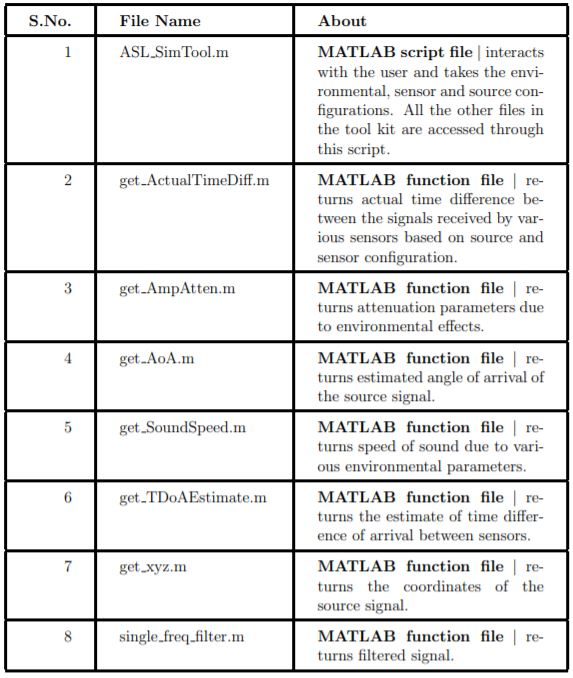

The follwong are the simulation files

# How to execute files?
To run the simulation and test the estimation algorithm,
1. Run the MATLAB script ASL SimTool.m
2. The program takes the environmental parameters, sensor configuration,
and signal source configuration as the input with prompts appearing
sequentially.
3. Observe the output for the given configuration and design the hardware
for acoustic source localization

